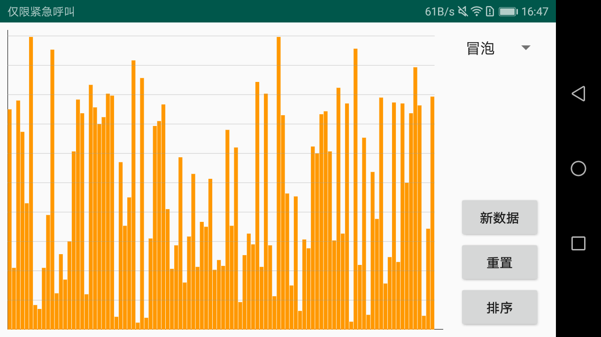
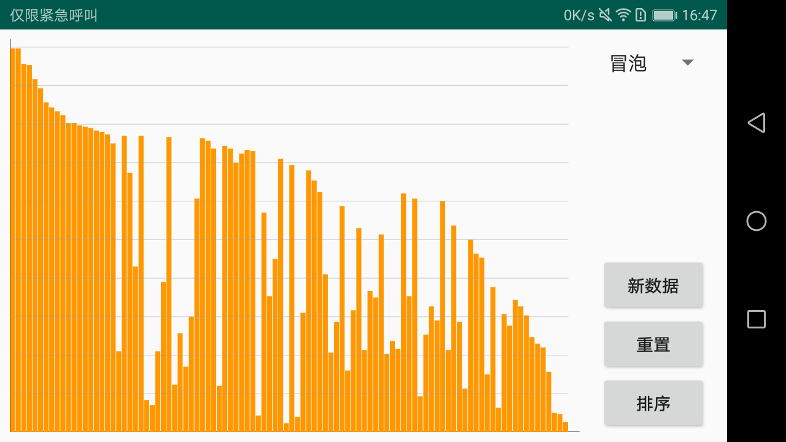
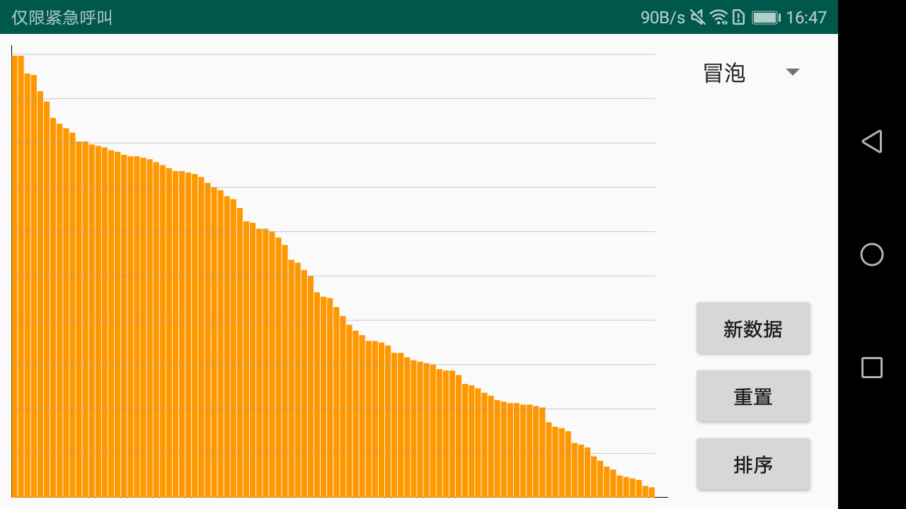

# visual-sortation
一个经典算法排序过程可视化的项目，目前实现的算法有：

- [x] 冒泡排序
- [x] 插入排序
- [x] 快速排序
- [x] 堆排序
- [x] 希尔排序
- [x] 归并排序
- [x] 选择排序

你可以添加其它排序算法。

### 注意

本项目是使用属性动画来展现各种排序算法的过程，注意仅仅是排序过程，就是每次待排序数据发生变化时先记录下来，然后通过属性动画来播放一遍，动画的时长=数据变化的次数*15，单位是秒杀，但是动画的时长（也相当于数据变化的次数）并不等同于该算法的时间复杂度，算法的时间复杂度需要根据算法的流程进行计算。

### 核心内容

最核心的内容在于`DataView`这个类，它是一个自定义的View，一个类柱状图，该类中的两个核心成员变量为`private ArrayList<int[]> dataFrames`和`private int offset`，dataFrames变量用于存放数据的排序中间过程，其中每一个元素都是一个int[]类型的数据，可以看做是一帧数据，而offset变量是用来控制当前需要显示哪一帧数据，最后通过ObjectAnimator对offset不断地修改从而做出数据变化的效果。

### 说明

- 为了方便，本项目对于DataView的绘制并没有设置可动态变化的属性，有兴趣的话可以自己做出修改，或者直接在源码中修改。

- 若需要添加其它排序算法，可以实现`com.spareyaya.visualsortation.sort.Sort`接口，实现的过程中记得把中间变化值添加到dataFrames中并返回，做法如下：

```java
datas.add(Arrays.copyOf(data, data.length));
```

注意需要把数据copy一份，不然最后只会得到同一份数据，就不会有动画效果了。

- 下面是排序前、排序中和已经完成排序的截图（gif播放太卡了所以只能上静态图）







